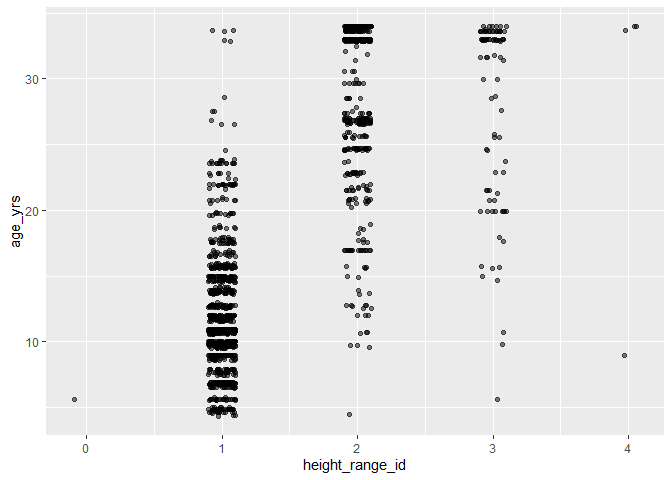

Mini Data Analysis Milestone 2
================
Negar Zaghi
October 25, 2023

*To complete this milestone, you can either edit [this `.rmd`
file](https://raw.githubusercontent.com/UBC-STAT/stat545.stat.ubc.ca/master/content/mini-project/mini-project-2.Rmd)
directly. Fill in the sections that are commented out with
`<!--- start your work here--->`. When you are done, make sure to knit
to an `.md` file by changing the output in the YAML header to
`github_document`, before submitting a tagged release on canvas.*

# Welcome to the rest of your mini data analysis project!

In Milestone 1, you explored your data. and came up with research
questions. This time, we will finish up our mini data analysis and
obtain results for your data by:

- Making summary tables and graphs
- Manipulating special data types in R: factors and/or dates and times.
- Fitting a model object to your data, and extract a result.
- Reading and writing data as separate files.

We will also explore more in depth the concept of *tidy data.*

**NOTE**: The main purpose of the mini data analysis is to integrate
what you learn in class in an analysis. Although each milestone provides
a framework for you to conduct your analysis, it’s possible that you
might find the instructions too rigid for your data set. If this is the
case, you may deviate from the instructions – just make sure you’re
demonstrating a wide range of tools and techniques taught in this class.

# Instructions

**To complete this milestone**, edit [this very `.Rmd`
file](https://raw.githubusercontent.com/UBC-STAT/stat545.stat.ubc.ca/master/content/mini-project/mini-project-2.Rmd)
directly. Fill in the sections that are tagged with
`<!--- start your work here--->`.

**To submit this milestone**, make sure to knit this `.Rmd` file to an
`.md` file by changing the YAML output settings from
`output: html_document` to `output: github_document`. Commit and push
all of your work to your mini-analysis GitHub repository, and tag a
release on GitHub. Then, submit a link to your tagged release on canvas.

**Points**: This milestone is worth 50 points: 45 for your analysis, and
5 for overall reproducibility, cleanliness, and coherence of the Github
submission.

**Research Questions**: In Milestone 1, you chose two research questions
to focus on. Wherever realistic, your work in this milestone should
relate to these research questions whenever we ask for justification
behind your work. In the case that some tasks in this milestone don’t
align well with one of your research questions, feel free to discuss
your results in the context of a different research question.

# Learning Objectives

By the end of this milestone, you should:

- Understand what *tidy* data is, and how to create it using `tidyr`.
- Generate a reproducible and clear report using R Markdown.
- Manipulating special data types in R: factors and/or dates and times.
- Fitting a model object to your data, and extract a result.
- Reading and writing data as separate files.

# Setup

Begin by loading your data and the tidyverse package below:

``` r
library(datateachr) # <- might contain the data you picked!
library(tidyverse)
library(ggplot2)
library(broom)
library(here)
```

# Task 1: Process and summarize your data

From milestone 1, you should have an idea of the basic structure of your
dataset (e.g. number of rows and columns, class types, etc.). Here, we
will start investigating your data more in-depth using various data
manipulation functions.

### 1.1 (1 point)

First, write out the 4 research questions you defined in milestone 1
were. This will guide your work through milestone 2:

<!-------------------------- Start your work below ---------------------------->

1.  *For each genus, what common names of trees are found in Vancouver?*

2.  *Is there a relationship between the diameter of trees and the age
    of trees? Analyze for the most common tree type*

3.  *What is the age vs height relationship of the most common tree?*

4.  *Is there a relationship between the height of trees and the
    diameter of trees?*
    <!----------------------------------------------------------------------------->

Here, we will investigate your data using various data manipulation and
graphing functions.

### 1.2 (8 points)

Now, for each of your four research questions, choose one task from
options 1-4 (summarizing), and one other task from 4-8 (graphing). You
should have 2 tasks done for each research question (8 total). Make sure
it makes sense to do them! (e.g. don’t use a numerical variables for a
task that needs a categorical variable.). Comment on why each task helps
(or doesn’t!) answer the corresponding research question.

Ensure that the output of each operation is printed!

Also make sure that you’re using dplyr and ggplot2 rather than base R.
Outside of this project, you may find that you prefer using base R
functions for certain tasks, and that’s just fine! But part of this
project is for you to practice the tools we learned in class, which is
dplyr and ggplot2.

**Summarizing:**

1.  Compute the *range*, *mean*, and *two other summary statistics* of
    **one numerical variable** across the groups of **one categorical
    variable** from your data.
2.  Compute the number of observations for at least one of your
    categorical variables. Do not use the function `table()`!
3.  Create a categorical variable with 3 or more groups from an existing
    numerical variable. You can use this new variable in the other
    tasks! *An example: age in years into “child, teen, adult, senior”.*
4.  Compute the proportion and counts in each category of one
    categorical variable across the groups of another categorical
    variable from your data. Do not use the function `table()`!

**Graphing:**

6.  Create a graph of your choosing, make one of the axes logarithmic,
    and format the axes labels so that they are “pretty” or easier to
    read.
7.  Make a graph where it makes sense to customize the alpha
    transparency.

Using variables and/or tables you made in one of the “Summarizing”
tasks:

8.  Create a graph that has at least two geom layers.
9.  Create 3 histograms, with each histogram having different sized
    bins. Pick the “best” one and explain why it is the best.

Make sure it’s clear what research question you are doing each operation
for!

<!------------------------- Start your work below ----------------------------->

#### **1)**

*For each genus, what common names of trees are found in Vancouver?*

**Summarizing:** Computing the number of genus_name observations and
number of common name observations. This helps to understand how many
genus names and common names of trees are in our data

``` r
van_trees_fct <- vancouver_trees %>%
  mutate(genus_name = factor(genus_name),
         common_name = factor(common_name))

n_genus_name = nlevels(van_trees_fct$genus_name)
n_common_name = nlevels(van_trees_fct$common_name)

head(van_trees_fct)
```

    ## # A tibble: 6 × 20
    ##   tree_id civic_number std_street genus_name species_name cultivar_name  
    ##     <dbl>        <dbl> <chr>      <fct>      <chr>        <chr>          
    ## 1  149556          494 W 58TH AV  ULMUS      AMERICANA    BRANDON        
    ## 2  149563          450 W 58TH AV  ZELKOVA    SERRATA      <NA>           
    ## 3  149579         4994 WINDSOR ST STYRAX     JAPONICA     <NA>           
    ## 4  149590          858 E 39TH AV  FRAXINUS   AMERICANA    AUTUMN APPLAUSE
    ## 5  149604         5032 WINDSOR ST ACER       CAMPESTRE    <NA>           
    ## 6  149616          585 W 61ST AV  PYRUS      CALLERYANA   CHANTICLEER    
    ## # ℹ 14 more variables: common_name <fct>, assigned <chr>, root_barrier <chr>,
    ## #   plant_area <chr>, on_street_block <dbl>, on_street <chr>,
    ## #   neighbourhood_name <chr>, street_side_name <chr>, height_range_id <dbl>,
    ## #   diameter <dbl>, curb <chr>, date_planted <date>, longitude <dbl>,
    ## #   latitude <dbl>

``` r
cat(paste("Number of genus_name observations:", n_genus_name))
```

    ## Number of genus_name observations: 97

``` r
cat(paste("Number of common_name observations:", n_common_name))
```

    ## Number of common_name observations: 634

``` r
genus <- van_trees_fct %>%
  group_by(genus_name) %>%
  summarise(frequency = n()) 

genus_freq <- genus %>%
  mutate(genus_name = fct_infreq(genus_name))

print(genus_freq)
```

    ## # A tibble: 97 × 2
    ##    genus_name  frequency
    ##    <fct>           <int>
    ##  1 ABIES             190
    ##  2 ACER            36062
    ##  3 AESCULUS         2570
    ##  4 AILANTHUS           4
    ##  5 ALBIZIA             1
    ##  6 ALNUS              74
    ##  7 AMELANCHIER       226
    ##  8 ARALIA              4
    ##  9 ARAUCARIA          10
    ## 10 ARBUTUS            10
    ## # ℹ 87 more rows

``` r
genus_common_freq <- van_trees_fct %>%
  group_by(genus_name, common_name) %>%
  summarise(frequency = n()) 
```

    ## `summarise()` has grouped output by 'genus_name'. You can override using the
    ## `.groups` argument.

``` r
print(genus_common_freq)
```

    ## # A tibble: 634 × 3
    ## # Groups:   genus_name [97]
    ##    genus_name common_name              frequency
    ##    <fct>      <fct>                        <int>
    ##  1 ABIES      ALPINE FIR                       1
    ##  2 ABIES      BALSAM FIR                       9
    ##  3 ABIES      GRAND FIR                      107
    ##  4 ABIES      HARVEST ORANGE JPN MAPLE        47
    ##  5 ABIES      KOREAN FIR                       9
    ##  6 ABIES      NOBLE FIR                        6
    ##  7 ABIES      NORDMAN FIR                      1
    ##  8 ABIES      WHITE FIR                       10
    ##  9 ACER       ALMIRA NORWAY MAPLE              9
    ## 10 ACER       AMUR MAPLE                     276
    ## # ℹ 624 more rows

**Graphing:** This helps to quickly see visually which genus are more
common in Vancouver

``` r
genus_barplot <- genus_freq %>%
  rename(count = frequency) %>%
  filter(count > 500) %>%
  ggplot(aes(genus_name, count)) +
  geom_bar(stat = "identity") +
  theme_minimal() +
  xlab("Genus Name") +
  ylab("Tree Count") +
  theme(axis.text.x = element_text(angle = 45, hjust = 1)) +
  labs(title = "Tree Counts for Genus Names with Counts > 500")

print(genus_barplot)
```

<!-- -->

#### **2)**

*Is there a relationship between the diameter of trees and the age of
trees? Analyze for the most common tree type*

**Summarizing:** Here, we are pulling out the most common tree in
Vancouver to analyze age vs diameter data

``` r
today = Sys.Date() #gets today's date

vancouver_trees_age <- vancouver_trees %>%
  mutate(age_yrs = (as.numeric(difftime(today, date_planted, units = "days"))) / 365.25) %>%
  #selects only specific columns
  select(genus_name,common_name,height_range_id,diameter,date_planted,age_yrs) 

print(vancouver_trees_age)
```

    ## # A tibble: 146,611 × 6
    ##    genus_name common_name          height_range_id diameter date_planted age_yrs
    ##    <chr>      <chr>                          <dbl>    <dbl> <date>         <dbl>
    ##  1 ULMUS      BRANDON ELM                        2     10   1999-01-13      24.8
    ##  2 ZELKOVA    JAPANESE ZELKOVA                   4     10   1996-05-31      27.4
    ##  3 STYRAX     JAPANESE SNOWBELL                  3      4   1993-11-22      29.9
    ##  4 FRAXINUS   AUTUMN APPLAUSE ASH                4     18   1996-04-29      27.5
    ##  5 ACER       HEDGE MAPLE                        2      9   1993-12-17      29.9
    ##  6 PYRUS      CHANTICLEER PEAR                   2      5   NA              NA  
    ##  7 ACER       COLUMNAR NORWAY MAP…               3     15   1993-12-16      29.9
    ##  8 ACER       COLUMNAR NORWAY MAP…               3     14   1993-12-16      29.9
    ##  9 ACER       COLUMNAR NORWAY MAP…               2     16   1993-12-16      29.9
    ## 10 FRAXINUS   AUTUMN APPLAUSE ASH                2      7.5 1993-12-03      29.9
    ## # ℹ 146,601 more rows

``` r
#Pulling out the common tree name that has the most number of trees in Vancouver
max_index <- which.max(genus_common_freq$frequency)

most_common_tree_genus <- genus_common_freq$genus_name[max_index]
most_common_tree <- genus_common_freq$common_name[max_index]
most_common_tree_row <- genus_common_freq[max_index, ]

print(most_common_tree_row)
```

    ## # A tibble: 1 × 3
    ## # Groups:   genus_name [1]
    ##   genus_name common_name              frequency
    ##   <fct>      <fct>                        <int>
    ## 1 PRUNUS     KWANZAN FLOWERING CHERRY     10529

``` r
most_common_tree_all <- vancouver_trees_age %>%
  filter(common_name == most_common_tree)

print(most_common_tree_all)
```

    ## # A tibble: 10,529 × 6
    ##    genus_name common_name          height_range_id diameter date_planted age_yrs
    ##    <chr>      <chr>                          <dbl>    <dbl> <date>         <dbl>
    ##  1 PRUNUS     KWANZAN FLOWERING C…               2     17   NA              NA  
    ##  2 PRUNUS     KWANZAN FLOWERING C…               2      9   NA              NA  
    ##  3 PRUNUS     KWANZAN FLOWERING C…               2     16   NA              NA  
    ##  4 PRUNUS     KWANZAN FLOWERING C…               2      9   NA              NA  
    ##  5 PRUNUS     KWANZAN FLOWERING C…               2      6.5 1996-12-11      26.9
    ##  6 PRUNUS     KWANZAN FLOWERING C…               3     37   NA              NA  
    ##  7 PRUNUS     KWANZAN FLOWERING C…               3     12   NA              NA  
    ##  8 PRUNUS     KWANZAN FLOWERING C…               2      6   NA              NA  
    ##  9 PRUNUS     KWANZAN FLOWERING C…               3     11.5 NA              NA  
    ## 10 PRUNUS     KWANZAN FLOWERING C…               3     18.5 NA              NA  
    ## # ℹ 10,519 more rows

**Graphing:** Here, we will plot age vs diameter of Vancouver’s most
common tree to see the correlation

``` r
diam_age_plot <- most_common_tree_all %>%
  ggplot(aes(age_yrs, diameter)) +
  geom_point(alpha = 0.3) +
  theme_classic() +
  xlab("Age (yrs)") +
  ylab("Diameter (in)") +
  coord_cartesian(ylim = c(0,40))

print(diam_age_plot)
```

    ## Warning: Removed 8980 rows containing missing values (`geom_point()`).

<!-- -->

#### **3)**

*What is the age vs height relationship of the most common tree?*

**Summarizing:**

``` r
mc_tree_height <- most_common_tree_all %>%
  select(genus_name,common_name,height_range_id,diameter,age_yrs) %>%
  filter(!is.na(age_yrs))

print(mc_tree_height)
```

    ## # A tibble: 1,549 × 5
    ##    genus_name common_name              height_range_id diameter age_yrs
    ##    <chr>      <chr>                              <dbl>    <dbl>   <dbl>
    ##  1 PRUNUS     KWANZAN FLOWERING CHERRY               2     6.5     26.9
    ##  2 PRUNUS     KWANZAN FLOWERING CHERRY               2     3       28.5
    ##  3 PRUNUS     KWANZAN FLOWERING CHERRY               1     3       11.6
    ##  4 PRUNUS     KWANZAN FLOWERING CHERRY               1     4.75    11.0
    ##  5 PRUNUS     KWANZAN FLOWERING CHERRY               1     7.75    10.0
    ##  6 PRUNUS     KWANZAN FLOWERING CHERRY               2     6       26.9
    ##  7 PRUNUS     KWANZAN FLOWERING CHERRY               2     8.5     24.5
    ##  8 PRUNUS     KWANZAN FLOWERING CHERRY               2     5.5     26.9
    ##  9 PRUNUS     KWANZAN FLOWERING CHERRY               1     5.25    17.8
    ## 10 PRUNUS     KWANZAN FLOWERING CHERRY               1     5       16.8
    ## # ℹ 1,539 more rows

``` r
height_mode <- mc_tree_height %>%
  group_by(height_range_id) %>%
  summarize(count = n()) %>%
  arrange(desc(count)) %>%
  filter(row_number() == 1) %>%
  pull(height_range_id)

cat("The mode of the hieght range id for the most common tree in Vancouver is:", height_mode)
```

    ## The mode of the hieght range id for the most common tree in Vancouver is: 1

**Graphing:** Using a jitterplot to understand the age of trees for each
height ID

``` r
heightID_age_jitterplot <- mc_tree_height %>%
  ggplot(aes(height_range_id, age_yrs)) +
  geom_jitter(width = 0.1, alpha = 0.5) 

print(heightID_age_jitterplot)
```

<!-- -->

#### **4)**

*Is there a relationship between the height of trees and the diameter of
trees?*

**Summarizing:** Find mean diameter of the most common tree in Vancouver

``` r
mc_tree_height_diam <- mc_tree_height

mean_diam <- mc_tree_height_diam %>%
  summarise(mean = mean(diameter))

print("The mean diameter for the most common tree in Vancouver is: ")
```

    ## [1] "The mean diameter for the most common tree in Vancouver is: "

``` r
print(mean_diam)
```

    ## # A tibble: 1 × 1
    ##    mean
    ##   <dbl>
    ## 1  6.96

**Graphing:** Using a jitterplot to understand the diameter of trees for
each height ID

``` r
heightID_diam_jitterplot <- mc_tree_height_diam %>%
  ggplot(aes(height_range_id, diameter)) +
  geom_jitter(width = 0.1, alpha = 0.5) 

print(heightID_diam_jitterplot)
```

<!-- -->

<!----------------------------------------------------------------------------->

### 1.3 (2 points)

Based on the operations that you’ve completed, how much closer are you
to answering your research questions? Think about what aspects of your
research questions remain unclear. Can your research questions be
refined, now that you’ve investigated your data a bit more? Which
research questions are yielding interesting results?

<!------------------------- Write your answer here ---------------------------->

Much closer! It is really interesting to see the two jitter plots
relating height ID vs age and height ID vs diameter!

<!----------------------------------------------------------------------------->

# Task 2: Tidy your data

In this task, we will do several exercises to reshape our data. The goal
here is to understand how to do this reshaping with the `tidyr` package.

A reminder of the definition of *tidy* data:

- Each row is an **observation**
- Each column is a **variable**
- Each cell is a **value**

### 2.1 (2 points)

Based on the definition above, can you identify if your data is tidy or
untidy? Go through all your columns, or if you have \>8 variables, just
pick 8, and explain whether the data is untidy or tidy.

<!--------------------------- Start your work below --------------------------->

The original data is not tidy but I have made it tidy for most of the
analysis above. I selected only the columns I am interested in and have
also removed all NA values.

<!----------------------------------------------------------------------------->

### 2.2 (4 points)

Now, if your data is tidy, untidy it! Then, tidy it back to it’s
original state.

If your data is untidy, then tidy it! Then, untidy it back to it’s
original state.

Be sure to explain your reasoning for this task. Show us the “before”
and “after”.

<!--------------------------- Start your work below --------------------------->

**This is how I tidied my data previously, now adding a bit more tidy
elements like removing more unnecessary columns and removing NA age_yrs
values:**

``` r
vancouver_trees_age_tidy <- vancouver_trees %>%
  mutate(age_yrs = (as.numeric(difftime(today, date_planted, units = "days"))) / 365.25) %>% #create age column
  select(genus_name,common_name,height_range_id,diameter,age_yrs) %>% #selects only specific columns
  filter(!is.na(age_yrs)) #remove age_yrs values that have no values.
```

*BEFORE —-\> The Untidy Data Set below contains more columns than needed
for analysis, has no “age” column that I need AND includes unnecessary
NA values for some rows*

``` r
print(vancouver_trees)
```

    ## # A tibble: 146,611 × 20
    ##    tree_id civic_number std_street    genus_name species_name cultivar_name  
    ##      <dbl>        <dbl> <chr>         <chr>      <chr>        <chr>          
    ##  1  149556          494 W 58TH AV     ULMUS      AMERICANA    BRANDON        
    ##  2  149563          450 W 58TH AV     ZELKOVA    SERRATA      <NA>           
    ##  3  149579         4994 WINDSOR ST    STYRAX     JAPONICA     <NA>           
    ##  4  149590          858 E 39TH AV     FRAXINUS   AMERICANA    AUTUMN APPLAUSE
    ##  5  149604         5032 WINDSOR ST    ACER       CAMPESTRE    <NA>           
    ##  6  149616          585 W 61ST AV     PYRUS      CALLERYANA   CHANTICLEER    
    ##  7  149617         4909 SHERBROOKE ST ACER       PLATANOIDES  COLUMNARE      
    ##  8  149618         4925 SHERBROOKE ST ACER       PLATANOIDES  COLUMNARE      
    ##  9  149619         4969 SHERBROOKE ST ACER       PLATANOIDES  COLUMNARE      
    ## 10  149625          720 E 39TH AV     FRAXINUS   AMERICANA    AUTUMN APPLAUSE
    ## # ℹ 146,601 more rows
    ## # ℹ 14 more variables: common_name <chr>, assigned <chr>, root_barrier <chr>,
    ## #   plant_area <chr>, on_street_block <dbl>, on_street <chr>,
    ## #   neighbourhood_name <chr>, street_side_name <chr>, height_range_id <dbl>,
    ## #   diameter <dbl>, curb <chr>, date_planted <date>, longitude <dbl>,
    ## #   latitude <dbl>

*AFTER —-\> The Tidy Data Set has a new column called “age_yrs”, only
the columns needed for analysis (genus name, common name, height ID,
diameter and age) and removes the NA values for the age_yrs column*

``` r
print(vancouver_trees_age_tidy)
```

    ## # A tibble: 70,063 × 5
    ##    genus_name common_name           height_range_id diameter age_yrs
    ##    <chr>      <chr>                           <dbl>    <dbl>   <dbl>
    ##  1 ULMUS      BRANDON ELM                         2    10       24.8
    ##  2 ZELKOVA    JAPANESE ZELKOVA                    4    10       27.4
    ##  3 STYRAX     JAPANESE SNOWBELL                   3     4       29.9
    ##  4 FRAXINUS   AUTUMN APPLAUSE ASH                 4    18       27.5
    ##  5 ACER       HEDGE MAPLE                         2     9       29.9
    ##  6 ACER       COLUMNAR NORWAY MAPLE               3    15       29.9
    ##  7 ACER       COLUMNAR NORWAY MAPLE               3    14       29.9
    ##  8 ACER       COLUMNAR NORWAY MAPLE               2    16       29.9
    ##  9 FRAXINUS   AUTUMN APPLAUSE ASH                 2     7.5     29.9
    ## 10 TILIA      CRIMEAN LINDEN                      2     7.75    29.9
    ## # ℹ 70,053 more rows

*Untidying the tidy data set by setting it equal to the original untidy
one*

``` r
vancouver_trees_age_untidy <- vancouver_trees
print(vancouver_trees_age_untidy)
```

    ## # A tibble: 146,611 × 20
    ##    tree_id civic_number std_street    genus_name species_name cultivar_name  
    ##      <dbl>        <dbl> <chr>         <chr>      <chr>        <chr>          
    ##  1  149556          494 W 58TH AV     ULMUS      AMERICANA    BRANDON        
    ##  2  149563          450 W 58TH AV     ZELKOVA    SERRATA      <NA>           
    ##  3  149579         4994 WINDSOR ST    STYRAX     JAPONICA     <NA>           
    ##  4  149590          858 E 39TH AV     FRAXINUS   AMERICANA    AUTUMN APPLAUSE
    ##  5  149604         5032 WINDSOR ST    ACER       CAMPESTRE    <NA>           
    ##  6  149616          585 W 61ST AV     PYRUS      CALLERYANA   CHANTICLEER    
    ##  7  149617         4909 SHERBROOKE ST ACER       PLATANOIDES  COLUMNARE      
    ##  8  149618         4925 SHERBROOKE ST ACER       PLATANOIDES  COLUMNARE      
    ##  9  149619         4969 SHERBROOKE ST ACER       PLATANOIDES  COLUMNARE      
    ## 10  149625          720 E 39TH AV     FRAXINUS   AMERICANA    AUTUMN APPLAUSE
    ## # ℹ 146,601 more rows
    ## # ℹ 14 more variables: common_name <chr>, assigned <chr>, root_barrier <chr>,
    ## #   plant_area <chr>, on_street_block <dbl>, on_street <chr>,
    ## #   neighbourhood_name <chr>, street_side_name <chr>, height_range_id <dbl>,
    ## #   diameter <dbl>, curb <chr>, date_planted <date>, longitude <dbl>,
    ## #   latitude <dbl>

<!----------------------------------------------------------------------------->

### 2.3 (4 points)

Now, you should be more familiar with your data, and also have made
progress in answering your research questions. Based on your interest,
and your analyses, pick 2 of the 4 research questions to continue your
analysis in the remaining tasks:

<!-------------------------- Start your work below ---------------------------->

1.  *Is there a relationship between the diameter of trees and the age
    of trees? Analyze for the most common tree type*

2.  *What is the age vs height relationship of the most common tree?*

<!----------------------------------------------------------------------------->

Explain your decision for choosing the above two research questions.

<!--------------------------- Start your work below --------------------------->

*The plots looked really interesting and I am always interesting to
understand how tree age affects height and diameter*

<!----------------------------------------------------------------------------->

Now, try to choose a version of your data that you think will be
appropriate to answer these 2 questions. Use between 4 and 8 functions
that we’ve covered so far (i.e. by filtering, cleaning, tidy’ing,
dropping irrelevant columns, etc.).

(If it makes more sense, then you can make/pick two versions of your
data, one for each research question.)

<!--------------------------- Start your work below --------------------------->

1.  *Is there a relationship between the diameter of trees and the age
    of trees? Analyze for the most common tree type*

Most clean data for this was created in the analysis in section 1 *see
section 1.2 for more details, below is the code rewritten:*

``` r
van_trees_fct <- vancouver_trees %>%
  mutate(genus_name = factor(genus_name),
         common_name = factor(common_name))

genus_common_freq <- van_trees_fct %>%
  group_by(genus_name, common_name) %>%
  summarise(frequency = n()) 
```

    ## `summarise()` has grouped output by 'genus_name'. You can override using the
    ## `.groups` argument.

``` r
max_index <- which.max(genus_common_freq$frequency)

most_common_tree <- genus_common_freq$common_name[max_index]

most_common_tree_all <- vancouver_trees_age %>%
  filter(common_name == most_common_tree)

mc_tree_height <- most_common_tree_all %>%
  select(genus_name,common_name,height_range_id,diameter,age_yrs) %>%
  filter(!is.na(age_yrs))

mc_tree_diam_age <- mc_tree_height %>%
  select(genus_name,common_name,diameter,age_yrs) #removed only the height_range_id

print(mc_tree_diam_age)
```

    ## # A tibble: 1,549 × 4
    ##    genus_name common_name              diameter age_yrs
    ##    <chr>      <chr>                       <dbl>   <dbl>
    ##  1 PRUNUS     KWANZAN FLOWERING CHERRY     6.5     26.9
    ##  2 PRUNUS     KWANZAN FLOWERING CHERRY     3       28.5
    ##  3 PRUNUS     KWANZAN FLOWERING CHERRY     3       11.6
    ##  4 PRUNUS     KWANZAN FLOWERING CHERRY     4.75    11.0
    ##  5 PRUNUS     KWANZAN FLOWERING CHERRY     7.75    10.0
    ##  6 PRUNUS     KWANZAN FLOWERING CHERRY     6       26.9
    ##  7 PRUNUS     KWANZAN FLOWERING CHERRY     8.5     24.5
    ##  8 PRUNUS     KWANZAN FLOWERING CHERRY     5.5     26.9
    ##  9 PRUNUS     KWANZAN FLOWERING CHERRY     5.25    17.8
    ## 10 PRUNUS     KWANZAN FLOWERING CHERRY     5       16.8
    ## # ℹ 1,539 more rows

2.  *What is the age vs height relationship of the most common tree?*

This data set is similar to the one for the previous questions just
focusing on a different column for analysis, see just above for details
in the code:

``` r
print(mc_tree_height)
```

    ## # A tibble: 1,549 × 5
    ##    genus_name common_name              height_range_id diameter age_yrs
    ##    <chr>      <chr>                              <dbl>    <dbl>   <dbl>
    ##  1 PRUNUS     KWANZAN FLOWERING CHERRY               2     6.5     26.9
    ##  2 PRUNUS     KWANZAN FLOWERING CHERRY               2     3       28.5
    ##  3 PRUNUS     KWANZAN FLOWERING CHERRY               1     3       11.6
    ##  4 PRUNUS     KWANZAN FLOWERING CHERRY               1     4.75    11.0
    ##  5 PRUNUS     KWANZAN FLOWERING CHERRY               1     7.75    10.0
    ##  6 PRUNUS     KWANZAN FLOWERING CHERRY               2     6       26.9
    ##  7 PRUNUS     KWANZAN FLOWERING CHERRY               2     8.5     24.5
    ##  8 PRUNUS     KWANZAN FLOWERING CHERRY               2     5.5     26.9
    ##  9 PRUNUS     KWANZAN FLOWERING CHERRY               1     5.25    17.8
    ## 10 PRUNUS     KWANZAN FLOWERING CHERRY               1     5       16.8
    ## # ℹ 1,539 more rows

# Task 3: Modelling

## 3.0 (no points)

Pick a research question from 1.2, and pick a variable of interest
(we’ll call it “Y”) that’s relevant to the research question. Indicate
these.

<!-------------------------- Start your work below ---------------------------->

**Research Question**: *Is there a relationship between the diameter of
trees and the age of trees? Analyze for the most common tree type*

**Variable of interest**: diameter of trees

<!----------------------------------------------------------------------------->

## 3.1 (3 points)

Fit a model or run a hypothesis test that provides insight on this
variable with respect to the research question. Store the model object
as a variable, and print its output to screen. We’ll omit having to
justify your choice, because we don’t expect you to know about model
specifics in STAT 545.

- **Note**: It’s OK if you don’t know how these models/tests work. Here
  are some examples of things you can do here, but the sky’s the limit.

  - You could fit a model that makes predictions on Y using another
    variable, by using the `lm()` function.
  - You could test whether the mean of Y equals 0 using `t.test()`, or
    maybe the mean across two groups are different using `t.test()`, or
    maybe the mean across multiple groups are different using `anova()`
    (you may have to pivot your data for the latter two).
  - You could use `lm()` to test for significance of regression
    coefficients.

<!-------------------------- Start your work below ---------------------------->

*Fitting a linear model to this data:*

``` r
model <- lm(diameter ~ age_yrs, data = mc_tree_diam_age)
summary(model)
```

    ## 
    ## Call:
    ## lm(formula = diameter ~ age_yrs, data = mc_tree_diam_age)
    ## 
    ## Residuals:
    ##     Min      1Q  Median      3Q     Max 
    ## -10.267  -1.963  -0.329   1.300  58.502 
    ## 
    ## Coefficients:
    ##             Estimate Std. Error t value Pr(>|t|)    
    ## (Intercept) -0.70769    0.22183   -3.19  0.00145 ** 
    ## age_yrs      0.41139    0.01055   39.01  < 2e-16 ***
    ## ---
    ## Signif. codes:  0 '***' 0.001 '**' 0.01 '*' 0.05 '.' 0.1 ' ' 1
    ## 
    ## Residual standard error: 4.048 on 1547 degrees of freedom
    ## Multiple R-squared:  0.4959, Adjusted R-squared:  0.4956 
    ## F-statistic:  1522 on 1 and 1547 DF,  p-value: < 2.2e-16

<!----------------------------------------------------------------------------->

## 3.2 (3 points)

Produce something relevant from your fitted model: either predictions on
Y, or a single value like a regression coefficient or a p-value.

- Be sure to indicate in writing what you chose to produce.
- Your code should either output a tibble (in which case you should
  indicate the column that contains the thing you’re looking for), or
  the thing you’re looking for itself.
- Obtain your results using the `broom` package if possible. If your
  model is not compatible with the broom function you’re needing, then
  you can obtain your results by some other means, but first indicate
  which broom function is not compatible.

<!-------------------------- Start your work below ---------------------------->

*Getting the R Squared value for this fit:*

``` r
model_summary <- glance(model)
r_squared <- model_summary$r.squared
cat("R-squared:", r_squared)
```

    ## R-squared: 0.4959252

<!----------------------------------------------------------------------------->

# Task 4: Reading and writing data

Get set up for this exercise by making a folder called `output` in the
top level of your project folder / repository. You’ll be saving things
there.

## 4.1 (3 points)

Take a summary table that you made from Task 1, and write it as a csv
file in your `output` folder. Use the `here::here()` function.

- **Robustness criteria**: You should be able to move your Mini Project
  repository / project folder to some other location on your computer,
  or move this very Rmd file to another location within your project
  repository / folder, and your code should still work.
- **Reproducibility criteria**: You should be able to delete the csv
  file, and remake it simply by knitting this Rmd file.

<!-------------------------- Start your work below ---------------------------->

``` r
write_delim(mc_tree_height, here("Output", "mc_tree_height.csv"))
```

<!----------------------------------------------------------------------------->

## 4.2 (3 points)

Write your model object from Task 3 to an R binary file (an RDS), and
load it again. Be sure to save the binary file in your `output` folder.
Use the functions `saveRDS()` and `readRDS()`.

- The same robustness and reproducibility criteria as in 4.1 apply here.

<!-------------------------- Start your work below ---------------------------->

``` r
saveRDS(model, file = here("Output", "model.rds"))

model_again <- readRDS(here("Output", "model.rds"))
print(model_again)
```

    ## 
    ## Call:
    ## lm(formula = diameter ~ age_yrs, data = mc_tree_diam_age)
    ## 
    ## Coefficients:
    ## (Intercept)      age_yrs  
    ##     -0.7077       0.4114

<!----------------------------------------------------------------------------->

# Overall Reproducibility/Cleanliness/Coherence Checklist

Here are the criteria we’re looking for.

## Coherence (0.5 points)

The document should read sensibly from top to bottom, with no major
continuity errors.

The README file should still satisfy the criteria from the last
milestone, i.e. it has been updated to match the changes to the
repository made in this milestone.

## File and folder structure (1 points)

You should have at least three folders in the top level of your
repository: one for each milestone, and one output folder. If there are
any other folders, these are explained in the main README.

Each milestone document is contained in its respective folder, and
nowhere else.

Every level-1 folder (that is, the ones stored in the top level, like
“Milestone1” and “output”) has a `README` file, explaining in a sentence
or two what is in the folder, in plain language (it’s enough to say
something like “This folder contains the source for Milestone 1”).

## Output (1 point)

All output is recent and relevant:

- All Rmd files have been `knit`ted to their output md files.
- All knitted md files are viewable without errors on Github. Examples
  of errors: Missing plots, “Sorry about that, but we can’t show files
  that are this big right now” messages, error messages from broken R
  code
- All of these output files are up-to-date – that is, they haven’t
  fallen behind after the source (Rmd) files have been updated.
- There should be no relic output files. For example, if you were
  knitting an Rmd to html, but then changed the output to be only a
  markdown file, then the html file is a relic and should be deleted.

Our recommendation: delete all output files, and re-knit each
milestone’s Rmd file, so that everything is up to date and relevant.

## Tagged release (0.5 point)

You’ve tagged a release for Milestone 2.

### Attribution

Thanks to Victor Yuan for mostly putting this together.
